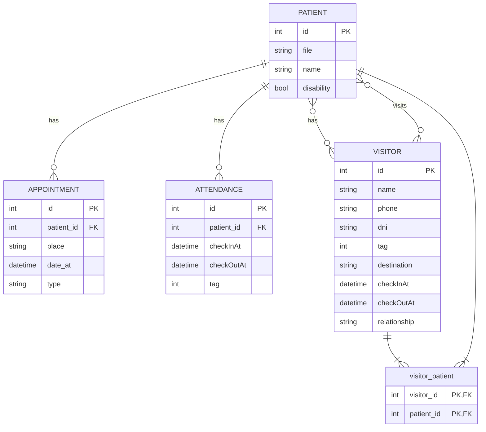

```mermaid
erDiagram
    PATIENT {
        int id PK
        string file
        string name
        bool disability
    }

    APPOINTMENT {
        int id PK
        int patient_id FK
        string place
        datetime date_at
        string type
    }

    ATTENDANCE {
        int id PK
        int patient_id FK
        datetime checkInAt
        datetime checkOutAt
        int tag
    }

    VISITOR {
        int id PK
        string name
        string phone
        string dni
        int tag
        string destination
        datetime checkInAt
        datetime checkOutAt
        string relationship
    }

    visitor_patient {
        int visitor_id PK, FK
        int patient_id PK, FK
    }

    PATIENT ||--o{ APPOINTMENT : "has"
    PATIENT ||--o{ ATTENDANCE : "has"
    PATIENT }o--o{ VISITOR : "has"
    VISITOR }o--o{ PATIENT : "visits"
    VISITOR ||--|{ visitor_patient : " "
    PATIENT ||--|{ visitor_patient : " "

```